  

  

  
  &nbsp;
  
  &nbsp;
  
  &nbsp;
  

 

  

 

  

 

---

 

<h3 align="center">Tech Stack</h3>

  

 

  

 

&nbsp;&nbsp;📋&nbsp;&nbsp;<b>Full Skill Breakdown</b>

 

| | Technologies |
|---|---|
| **Languages** | Python · TypeScript · JavaScript · Java · C++ |
| **Frontend** | React · Next.js · Tailwind CSS · HTML5 / CSS3 |
| **Backend** | Node.js · Django · Flask · Express.js |
| **Databases** | PostgreSQL · MongoDB · MySQL · Firebase · Supabase |
| **Cloud** | AWS · Azure · Docker · Git / GitHub |
| **AI / ML** | TensorFlow · HuggingFace · Ollama · Gemini API |
| **Leadership** | Program Management · Operations · Community Building |

 

---

 

<h3 align="center">Experience</h3>

  

 

---

 

<h3 align="center">Achievements</h3>

  

 

---

 

<h3 align="center">Projects</h3>

  

 

---

 

<h3 align="center">GitHub Analytics</h3>

 

  
  &nbsp;&nbsp;&nbsp;
  

 

  

 

  

 

---

 

<h3 align="center">Current Focus</h3>

  

 

---

 

  
  &nbsp;
  
  &nbsp;
  

 

  Built with ☕ and code — Subhash Malik

